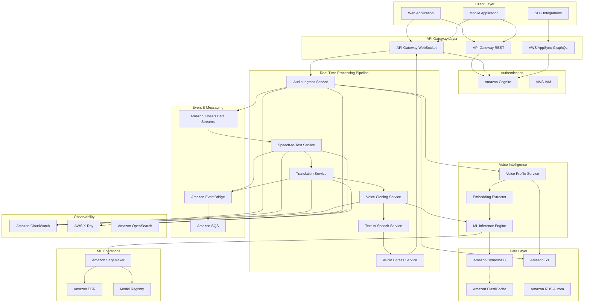
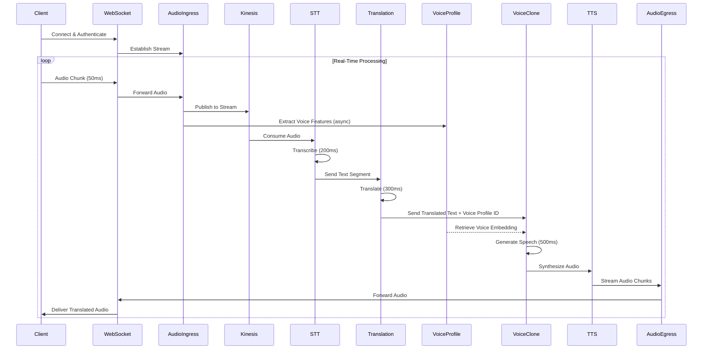
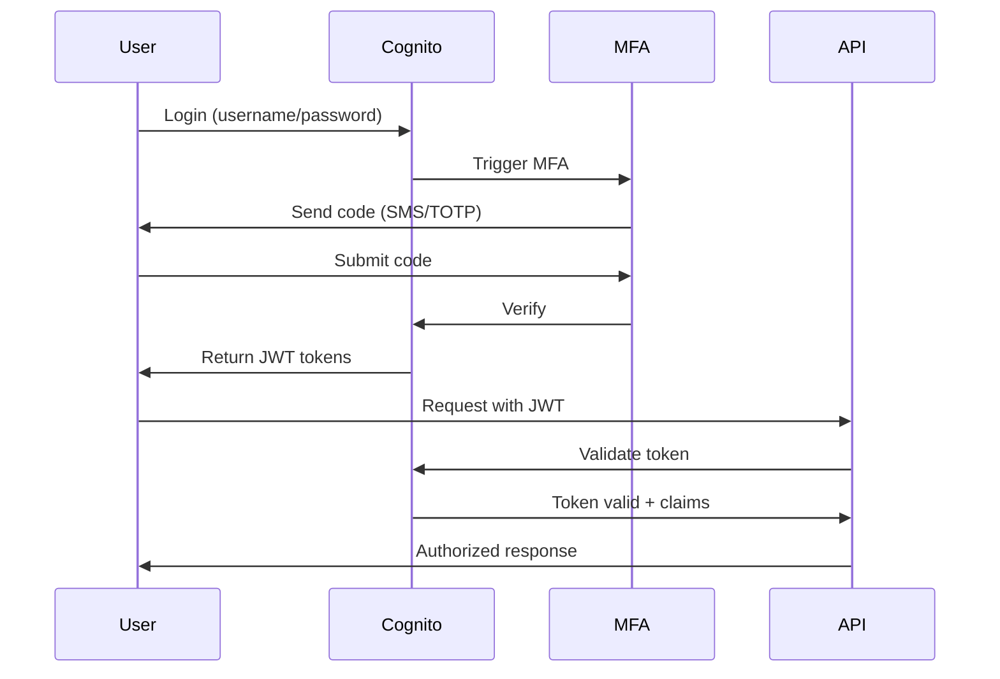
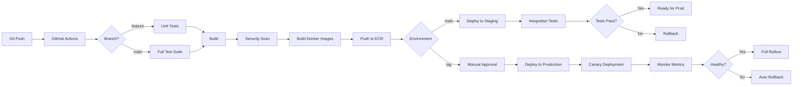

# Design Document: UniVoice Real-Time Speech Translation Platform

## Overview

UniVoice is a production-ready, cloud-native real-time speech-to-speech translation platform built on AWS infrastructure. The system processes live audio streams through a multi-stage pipeline: speech recognition, translation, voice cloning, and synthesis, all while maintaining sub-2-second end-to-end latency and preserving the speaker's voice identity.

The architecture follows microservices patterns with event-driven communication, leveraging AWS managed services for scalability, reliability, and operational excellence. The platform is designed to handle 100,000+ concurrent users globally with 99.9% uptime.

### Design Principles

1. **Latency-First Architecture**: Every component optimized for real-time processing
2. **Serverless-First**: Use managed services to reduce operational overhead
3. **Security by Design**: End-to-end encryption and zero-trust architecture
4. **Observable Systems**: Comprehensive monitoring, logging, and tracing
5. **Cost-Aware**: Optimize for performance within budget constraints
6. **Graceful Degradation**: Fallback mechanisms for component failures

## Architecture

### High-Level System Architecture

The UniVoice platform consists of seven primary subsystems:

1. **API Gateway Layer**: Entry point for all client requests (REST, WebSocket, GraphQL)
2. **Real-Time Processing Pipeline**: Streaming audio processing with STT, translation, and TTS
3. **Voice Intelligence Layer**: ML-based voice profiling and cloning
4. **Data Layer**: Multi-tier storage for sessions, profiles, and recordings
5. **Authentication & Authorization**: Identity management and access control
6. **Observability Stack**: Monitoring, logging, tracing, and alerting
7. **ML Operations**: Model training, versioning, and deployment


### System Architecture Diagram



### Data Flow Architecture



### Scaling Model

The platform implements multi-dimensional auto-scaling:

**Horizontal Scaling**:
- ECS Fargate tasks scale based on CPU/memory utilization and request queue depth
- Target: 70% CPU utilization, max 1000 messages in queue
- Scale-out: Add tasks when thresholds exceeded for 2 minutes
- Scale-in: Remove tasks when below 40% utilization for 10 minutes

**Geographic Distribution**:
- Multi-region deployment: US-East-1 (primary), EU-West-1, AP-Southeast-1
- Route 53 latency-based routing directs users to nearest region
- Cross-region replication for voice profiles and session data

**Service-Specific Scaling**:
- STT Service: Scale based on Kinesis stream lag
- Translation Service: Scale based on SQS queue depth
- Voice Cloning: Scale based on GPU utilization (target 80%)
- ML Inference: SageMaker auto-scaling with 2-minute warm-up

**Capacity Planning**:
- Reserve 20% overhead capacity for traffic spikes
- Pre-warm instances during predicted high-traffic periods
- Implement predictive scaling based on historical patterns


### Failover and Disaster Recovery

**High Availability Design**:
- Multi-AZ deployment for all stateful services
- Active-Active configuration across regions for read operations
- Active-Passive for write operations with automatic failover

**Recovery Time Objectives (RTO) and Recovery Point Objectives (RPO)**:
- Critical Services (STT, Translation, TTS): RTO < 1 minute, RPO < 5 seconds
- Voice Profiles: RTO < 5 minutes, RPO < 1 minute
- Session Data: RTO < 5 minutes, RPO < 30 seconds
- Historical Data: RTO < 1 hour, RPO < 15 minutes

**Disaster Recovery Strategy**:
- Continuous replication of DynamoDB tables across regions
- S3 cross-region replication for voice profiles and recordings
- Automated failover using Route 53 health checks
- Regular DR drills (monthly) with automated runbooks

**Backup Strategy**:
- DynamoDB: Point-in-time recovery enabled (35-day retention)
- S3: Versioning enabled with lifecycle policies
- RDS Aurora: Automated backups with 7-day retention
- Configuration: Stored in AWS Systems Manager Parameter Store with versioning


## Components and Interfaces

### 1. API Gateway Layer

**AWS Service Mapping**:
- **Amazon API Gateway (REST)**: Session management, configuration, user profile APIs
- **Amazon API Gateway (WebSocket)**: Real-time audio streaming bidirectional communication
- **AWS AppSync**: GraphQL API for complex queries and subscriptions

**REST API Endpoints**:

```
POST   /v1/sessions                    # Create new translation session
GET    /v1/sessions/{sessionId}        # Get session details
DELETE /v1/sessions/{sessionId}        # End session
PATCH  /v1/sessions/{sessionId}        # Update session configuration

GET    /v1/voice-profiles/{userId}     # Get user voice profile
POST   /v1/voice-profiles              # Create voice profile
DELETE /v1/voice-profiles/{profileId}  # Delete voice profile

GET    /v1/languages                   # List supported languages
GET    /v1/languages/pairs             # Get supported translation pairs

POST   /v1/recordings/{sessionId}      # Request session recording
GET    /v1/recordings/{recordingId}    # Download recording

GET    /v1/metrics/session/{sessionId} # Get session metrics
GET    /v1/health                      # Health check endpoint
```

**WebSocket API Routes**:

```
$connect                               # Establish connection with auth
$disconnect                            # Clean up connection
$default                               # Default message handler

audio.stream                           # Stream audio chunks
audio.control                          # Control commands (pause, resume, stop)
session.configure                      # Update session settings
session.status                         # Request session status
```


**GraphQL Schema** (AWS AppSync):

```graphql
type Session {
  id: ID!
  userId: String!
  sourceLanguage: String!
  targetLanguage: String!
  status: SessionStatus!
  speakers: [Speaker!]!
  startTime: AWSDateTime!
  endTime: AWSDateTime
  metrics: SessionMetrics
}

type Speaker {
  id: ID!
  voiceProfileId: String!
  joinedAt: AWSDateTime!
  utteranceCount: Int!
}

type SessionMetrics {
  averageLatency: Float!
  p95Latency: Float!
  totalDuration: Int!
  audioQuality: Float!
}

enum SessionStatus {
  ACTIVE
  PAUSED
  ENDED
  ERROR
}

type Query {
  getSession(id: ID!): Session
  listSessions(userId: String!, limit: Int, nextToken: String): SessionConnection
  getVoiceProfile(id: ID!): VoiceProfile
}

type Mutation {
  createSession(input: CreateSessionInput!): Session
  updateSession(id: ID!, input: UpdateSessionInput!): Session
  endSession(id: ID!): Session
}

type Subscription {
  onSessionUpdate(sessionId: ID!): Session
  onTranslationSegment(sessionId: ID!): TranslationSegment
}
```


### 2. Audio Ingress Service

**AWS Service Mapping**:
- **Amazon ECS Fargate**: Container orchestration for service instances
- **Amazon Kinesis Data Streams**: Audio chunk streaming
- **Amazon S3**: Raw audio storage for analysis and training

**Responsibilities**:
- Accept WebSocket audio streams from clients
- Validate audio format and quality
- Buffer audio chunks (50ms windows)
- Publish to Kinesis Data Streams
- Trigger voice profile extraction
- Handle connection lifecycle

**Interface**:

```typescript
interface AudioIngressService {
  // Accept incoming audio stream
  handleAudioStream(
    connectionId: string,
    sessionId: string,
    audioChunk: AudioChunk
  ): Promise<void>

  // Validate audio quality
  validateAudioQuality(audioChunk: AudioChunk): AudioQualityReport

  // Publish to processing pipeline
  publishToStream(
    sessionId: string,
    audioChunk: AudioChunk,
    metadata: AudioMetadata
  ): Promise<void>
}

interface AudioChunk {
  data: Buffer           // Raw audio bytes
  format: AudioFormat    // WAV, MP3, Opus
  sampleRate: number     // Hz (minimum 16000)
  channels: number       // 1 (mono) or 2 (stereo)
  timestamp: number      // Unix timestamp in ms
  sequenceNumber: number // Chunk sequence
}

interface AudioQualityReport {
  isValid: boolean
  sampleRate: number
  signalToNoiseRatio: number
  clippingDetected: boolean
  issues: string[]
}
```


### 3. Speech-to-Text Service

**AWS Service Mapping**:
- **Amazon Transcribe Streaming**: Real-time speech recognition
- **Amazon ECS Fargate**: Service orchestration
- **Amazon Kinesis Data Streams**: Input audio consumption

**Responsibilities**:
- Consume audio chunks from Kinesis
- Perform real-time transcription using Amazon Transcribe
- Apply speaker diarization for multi-speaker scenarios
- Emit partial and final transcriptions
- Handle multiple languages (50+ supported)

**Interface**:

```typescript
interface STTService {
  // Process audio stream
  transcribeStream(
    sessionId: string,
    audioStream: KinesisStream
  ): AsyncIterator<TranscriptionResult>

  // Configure transcription settings
  configureTranscription(config: TranscriptionConfig): void
}

interface TranscriptionConfig {
  language: string              // BCP-47 language code
  enableSpeakerDiarization: boolean
  maxSpeakers: number          // 1-10
  vocabularyName?: string      // Custom vocabulary
  contentRedaction?: RedactionConfig
}

interface TranscriptionResult {
  sessionId: string
  resultId: string
  isPartial: boolean           // true for interim results
  transcript: string
  confidence: number           // 0.0 - 1.0
  startTime: number           // ms from session start
  endTime: number             // ms from session start
  speaker?: string            // Speaker ID if diarization enabled
  alternatives?: Alternative[] // Alternative transcriptions
}

interface Alternative {
  transcript: string
  confidence: number
}
```


### 4. Translation Service

**AWS Service Mapping**:
- **Amazon Translate**: Neural machine translation
- **Amazon ECS Fargate**: Service orchestration
- **Amazon ElastiCache (Redis)**: Context caching for session continuity
- **Amazon SQS**: Asynchronous translation queue

**Responsibilities**:
- Translate text between 50+ language pairs
- Maintain conversation context within sessions
- Handle idiomatic expressions and named entities
- Provide translation confidence scores
- Support custom terminology

**Interface**:

```typescript
interface TranslationService {
  // Translate text segment
  translate(request: TranslationRequest): Promise<TranslationResult>

  // Batch translate multiple segments
  translateBatch(requests: TranslationRequest[]): Promise<TranslationResult[]>

  // Update session context
  updateContext(sessionId: string, context: ConversationContext): void
}

interface TranslationRequest {
  sessionId: string
  segmentId: string
  sourceText: string
  sourceLanguage: string        // BCP-47 code
  targetLanguage: string        // BCP-47 code
  context?: ConversationContext
  customTerminology?: string    // Terminology name
}

interface TranslationResult {
  sessionId: string
  segmentId: string
  translatedText: string
  confidence: number            // 0.0 - 1.0
  sourceLanguage: string
  targetLanguage: string
  alternatives?: string[]       // Alternative translations
  detectedEntities?: Entity[]   // Named entities preserved
  latency: number              // Processing time in ms
}

interface ConversationContext {
  previousSegments: string[]    // Last 5 segments for context
  domain?: string              // medical, legal, technical, etc.
  formality?: 'formal' | 'informal'
}

interface Entity {
  text: string
  type: 'PERSON' | 'LOCATION' | 'ORGANIZATION' | 'BRAND'
  startOffset: number
  endOffset: number
}
```


### 5. Voice Profile Service

**AWS Service Mapping**:
- **Amazon SageMaker**: ML model hosting for embedding extraction
- **Amazon ECS Fargate**: Service orchestration
- **Amazon DynamoDB**: Voice profile metadata storage
- **Amazon S3**: Voice embedding storage
- **Amazon ElastiCache**: Voice profile caching

**Responsibilities**:
- Extract voice embeddings from audio samples
- Create and manage voice profiles
- Update profiles adaptively with new audio
- Retrieve voice profiles for synthesis
- Ensure voice profile uniqueness

**Interface**:

```typescript
interface VoiceProfileService {
  // Create new voice profile
  createProfile(request: CreateProfileRequest): Promise<VoiceProfile>

  // Get existing profile
  getProfile(profileId: string): Promise<VoiceProfile>

  // Update profile with new audio
  updateProfile(
    profileId: string,
    audioSamples: AudioChunk[]
  ): Promise<VoiceProfile>

  // Extract voice embedding
  extractEmbedding(audioSamples: AudioChunk[]): Promise<VoiceEmbedding>
}

interface CreateProfileRequest {
  userId: string
  sessionId: string
  audioSamples: AudioChunk[]    // Minimum 3 seconds of audio
  language: string
  metadata?: ProfileMetadata
}

interface VoiceProfile {
  profileId: string
  userId: string
  embedding: VoiceEmbedding
  characteristics: VoiceCharacteristics
  createdAt: number
  updatedAt: number
  sampleCount: number           // Number of audio samples used
  quality: number               // Profile quality score 0-1
}

interface VoiceEmbedding {
  vector: number[]              // 256-dimensional embedding
  version: string               // Model version used
}

interface VoiceCharacteristics {
  pitchMean: number            // Hz
  pitchStdDev: number          // Hz
  speakingRate: number         // Words per minute
  energyMean: number           // dB
  spectralCentroid: number     // Hz
  emotionalTone?: EmotionalProfile
}

interface EmotionalProfile {
  valence: number              // -1 (negative) to 1 (positive)
  arousal: number              // 0 (calm) to 1 (excited)
  dominance: number            // 0 (submissive) to 1 (dominant)
}
```


### 6. Voice Cloning Service

**AWS Service Mapping**:
- **Amazon SageMaker**: ML inference for voice cloning models
- **Amazon ECS Fargate**: Service orchestration
- **Amazon EC2 (GPU instances)**: High-performance inference
- **Amazon ElastiCache**: Model output caching

**Responsibilities**:
- Generate speech using voice profiles
- Preserve emotional tone from source
- Maintain voice consistency across utterances
- Stream synthesis for long outputs
- Optimize for real-time latency

**Interface**:

```typescript
interface VoiceCloningService {
  // Generate speech with voice cloning
  synthesize(request: SynthesisRequest): Promise<SynthesisResult>

  // Stream synthesis for long text
  synthesizeStream(
    request: SynthesisRequest
  ): AsyncIterator<AudioChunk>

  // Warm up model for specific voice profile
  warmupModel(profileId: string): Promise<void>
}

interface SynthesisRequest {
  sessionId: string
  segmentId: string
  text: string
  voiceProfileId: string
  targetLanguage: string
  emotionalContext?: EmotionalContext
  prosodyHints?: ProsodyHints
}

interface EmotionalContext {
  sourceEmotion: EmotionalProfile  // From original speech
  preserveEmotion: boolean         // Whether to transfer emotion
}

interface ProsodyHints {
  speakingRate?: number           // 0.5 - 2.0 (1.0 = normal)
  pitchShift?: number             // -12 to +12 semitones
  emphasis?: EmphasisSpan[]       // Words to emphasize
}

interface EmphasisSpan {
  startWord: number
  endWord: number
  level: 'strong' | 'moderate' | 'reduced'
}

interface SynthesisResult {
  sessionId: string
  segmentId: string
  audio: AudioChunk[]
  duration: number                // ms
  voiceProfileId: string
  latency: number                 // Processing time in ms
  quality: number                 // MOS score estimate
}
```


### 7. Session Manager Service

**AWS Service Mapping**:
- **Amazon DynamoDB**: Session state storage
- **Amazon ElastiCache (Redis)**: Active session caching
- **Amazon EventBridge**: Session lifecycle events
- **AWS Lambda**: Session lifecycle handlers

**Responsibilities**:
- Create and manage translation sessions
- Track session state and metadata
- Manage multi-speaker sessions
- Handle session pause/resume
- Implement session timeout
- Generate session summaries

**Interface**:

```typescript
interface SessionManagerService {
  // Create new session
  createSession(request: CreateSessionRequest): Promise<Session>

  // Get session details
  getSession(sessionId: string): Promise<Session>

  // Update session state
  updateSession(
    sessionId: string,
    updates: SessionUpdate
  ): Promise<Session>

  // End session
  endSession(sessionId: string): Promise<SessionSummary>

  // Add speaker to session
  addSpeaker(
    sessionId: string,
    speaker: SpeakerInfo
  ): Promise<void>
}

interface CreateSessionRequest {
  userId: string
  sourceLanguage: string
  targetLanguage: string
  recordingEnabled: boolean
  maxSpeakers: number
  configuration?: SessionConfiguration
}

interface Session {
  sessionId: string
  userId: string
  status: 'ACTIVE' | 'PAUSED' | 'ENDED' | 'ERROR'
  sourceLanguage: string
  targetLanguage: string
  speakers: Map<string, SpeakerInfo>
  startTime: number
  endTime?: number
  configuration: SessionConfiguration
  metrics: SessionMetrics
}

interface SpeakerInfo {
  speakerId: string
  voiceProfileId: string
  joinedAt: number
  utteranceCount: number
  totalSpeakingTime: number     // ms
}

interface SessionConfiguration {
  enableRecording: boolean
  enableDiarization: boolean
  maxLatency: number            // ms
  qualityMode: 'speed' | 'balanced' | 'quality'
  customTerminology?: string
}

interface SessionMetrics {
  totalSegments: number
  averageLatency: number        // ms
  p50Latency: number
  p95Latency: number
  p99Latency: number
  errorCount: number
  audioQualityAverage: number
}

interface SessionSummary {
  sessionId: string
  duration: number              // ms
  segmentCount: number
  speakerCount: number
  languages: [string, string]   // [source, target]
  metrics: SessionMetrics
  recordingUrl?: string
}
```


### 8. Authentication Service

**AWS Service Mapping**:
- **Amazon Cognito**: User authentication and identity management
- **AWS IAM**: Service-to-service authorization
- **AWS Secrets Manager**: API key and credential storage
- **Amazon DynamoDB**: User profile and permissions storage

**Responsibilities**:
- User authentication (username/password, OAuth, SAML)
- Multi-factor authentication
- API key management
- Role-based access control
- Token generation and validation
- Audit logging

**Interface**:

```typescript
interface AuthenticationService {
  // Authenticate user
  authenticate(credentials: Credentials): Promise<AuthToken>

  // Validate token
  validateToken(token: string): Promise<TokenValidation>

  // Refresh token
  refreshToken(refreshToken: string): Promise<AuthToken>

  // Revoke token
  revokeToken(token: string): Promise<void>

  // Check permissions
  authorize(
    userId: string,
    resource: string,
    action: string
  ): Promise<boolean>
}

interface Credentials {
  type: 'password' | 'oauth' | 'api_key'
  username?: string
  password?: string
  oauthToken?: string
  apiKey?: string
  mfaCode?: string
}

interface AuthToken {
  accessToken: string
  refreshToken: string
  idToken: string
  expiresIn: number             // seconds
  tokenType: 'Bearer'
  scope: string[]
}

interface TokenValidation {
  isValid: boolean
  userId: string
  email: string
  roles: string[]
  permissions: Permission[]
  expiresAt: number
}

interface Permission {
  resource: string              // e.g., "sessions", "voice-profiles"
  actions: string[]            // e.g., ["read", "write", "delete"]
  conditions?: Record<string, any>
}
```


## Data Models

### DynamoDB Table Design

**Table 1: Sessions**

```
Table Name: univoice-sessions
Partition Key: sessionId (String)
Sort Key: N/A

Attributes:
- sessionId: String (PK)
- userId: String (GSI PK)
- status: String (ACTIVE | PAUSED | ENDED | ERROR)
- sourceLanguage: String
- targetLanguage: String
- speakers: Map<String, SpeakerInfo>
- startTime: Number (Unix timestamp)
- endTime: Number (Unix timestamp, optional)
- configuration: Map
- metrics: Map
- ttl: Number (Unix timestamp, 90 days after endTime)

Global Secondary Indexes:
- UserSessionsIndex: userId (PK), startTime (SK)
- StatusIndex: status (PK), startTime (SK)

Capacity: On-Demand
Encryption: AWS managed key
Point-in-time recovery: Enabled
```

**Table 2: VoiceProfiles**

```
Table Name: univoice-voice-profiles
Partition Key: profileId (String)
Sort Key: N/A

Attributes:
- profileId: String (PK)
- userId: String (GSI PK)
- embeddingS3Key: String (S3 location)
- characteristics: Map
- createdAt: Number
- updatedAt: Number
- sampleCount: Number
- quality: Number
- language: String
- version: String (model version)

Global Secondary Indexes:
- UserProfilesIndex: userId (PK), createdAt (SK)

Capacity: On-Demand
Encryption: Customer managed key (KMS)
Point-in-time recovery: Enabled
```


**Table 3: Users**

```
Table Name: univoice-users
Partition Key: userId (String)
Sort Key: N/A

Attributes:
- userId: String (PK)
- email: String (GSI PK)
- cognitoId: String
- roles: List<String>
- permissions: Map
- preferences: Map
- createdAt: Number
- lastLoginAt: Number
- subscriptionTier: String
- quotas: Map (usage limits)

Global Secondary Indexes:
- EmailIndex: email (PK)

Capacity: On-Demand
Encryption: AWS managed key
```

**Table 4: TranslationSegments**

```
Table Name: univoice-translation-segments
Partition Key: sessionId (String)
Sort Key: segmentId (String)

Attributes:
- sessionId: String (PK)
- segmentId: String (SK)
- sourceText: String
- translatedText: String
- sourceLanguage: String
- targetLanguage: String
- speakerId: String
- startTime: Number
- endTime: Number
- confidence: Number
- latency: Number
- ttl: Number (30 days)

Capacity: On-Demand
Stream: Enabled (for analytics)
```


### S3 Bucket Structure

**Bucket 1: univoice-voice-embeddings-{region}**

```
Purpose: Store voice embedding vectors
Structure:
  /embeddings/
    /{userId}/
      /{profileId}/
        /embedding.bin          # Binary embedding vector
        /metadata.json          # Profile metadata
        /samples/              # Audio samples used
          /sample-{timestamp}.wav

Encryption: SSE-KMS with customer managed key
Versioning: Enabled
Lifecycle:
  - Transition to IA after 90 days
  - Transition to Glacier after 365 days
Replication: Cross-region to DR region
```

**Bucket 2: univoice-session-recordings-{region}**

```
Purpose: Store session recordings (if enabled)
Structure:
  /recordings/
    /{year}/
      /{month}/
        /{day}/
          /{sessionId}/
            /source-audio.wav
            /translated-audio.wav
            /transcript.json
            /metadata.json

Encryption: SSE-KMS
Versioning: Disabled
Lifecycle:
  - Transition to IA after 30 days
  - Transition to Glacier after 90 days
  - Delete after 2 years (compliance requirement)
Access Logging: Enabled
```

**Bucket 3: univoice-ml-models-{region}**

```
Purpose: Store ML model artifacts
Structure:
  /models/
    /voice-embedding/
      /{version}/
        /model.tar.gz
        /config.json
    /voice-cloning/
      /{version}/
        /model.tar.gz
        /config.json
        /vocab.json

Encryption: SSE-S3
Versioning: Enabled
Replication: Cross-region
```


### ElastiCache (Redis) Schema

**Cluster Configuration**:
- Engine: Redis 7.0
- Node Type: cache.r6g.xlarge (for production)
- Cluster Mode: Enabled (3 shards, 2 replicas per shard)
- Encryption: In-transit and at-rest enabled

**Key Patterns**:

```
# Active session cache
session:{sessionId}                    # Session object (TTL: 2 hours)
session:{sessionId}:speakers           # Speaker map (TTL: 2 hours)
session:{sessionId}:context            # Conversation context (TTL: 2 hours)

# Voice profile cache
voice-profile:{profileId}              # Voice profile (TTL: 1 hour)
voice-embedding:{profileId}            # Embedding vector (TTL: 1 hour)

# Translation context cache
translation-context:{sessionId}        # Recent segments (TTL: 30 min)

# Rate limiting
rate-limit:user:{userId}:{endpoint}    # Request counter (TTL: 1 min)
rate-limit:ip:{ipAddress}              # IP-based limiting (TTL: 1 min)

# WebSocket connections
ws-connection:{connectionId}           # Connection metadata (TTL: 2 hours)
ws-session:{sessionId}:connections     # Set of connection IDs

# Model warm-up tracking
model-warmup:{profileId}               # Warm model indicator (TTL: 10 min)
```


### RDS Aurora Schema (Optional - for analytics)

**Database: univoice_analytics**

```sql
-- Session analytics table
CREATE TABLE session_analytics (
  session_id VARCHAR(64) PRIMARY KEY,
  user_id VARCHAR(64) NOT NULL,
  start_time TIMESTAMP NOT NULL,
  end_time TIMESTAMP,
  duration_ms INTEGER,
  source_language VARCHAR(10),
  target_language VARCHAR(10),
  speaker_count INTEGER,
  segment_count INTEGER,
  avg_latency_ms DECIMAL(10,2),
  p95_latency_ms DECIMAL(10,2),
  error_count INTEGER,
  audio_quality_avg DECIMAL(3,2),
  created_at TIMESTAMP DEFAULT CURRENT_TIMESTAMP,
  INDEX idx_user_start (user_id, start_time),
  INDEX idx_start_time (start_time)
);

-- Latency metrics table
CREATE TABLE latency_metrics (
  id BIGINT AUTO_INCREMENT PRIMARY KEY,
  session_id VARCHAR(64) NOT NULL,
  segment_id VARCHAR(64) NOT NULL,
  stt_latency_ms INTEGER,
  translation_latency_ms INTEGER,
  tts_latency_ms INTEGER,
  total_latency_ms INTEGER,
  timestamp TIMESTAMP NOT NULL,
  INDEX idx_session (session_id),
  INDEX idx_timestamp (timestamp)
);

-- Error logs table
CREATE TABLE error_logs (
  id BIGINT AUTO_INCREMENT PRIMARY KEY,
  session_id VARCHAR(64),
  service_name VARCHAR(64) NOT NULL,
  error_type VARCHAR(128) NOT NULL,
  error_message TEXT,
  stack_trace TEXT,
  timestamp TIMESTAMP NOT NULL,
  INDEX idx_session (session_id),
  INDEX idx_service_time (service_name, timestamp)
);
```


## Machine Learning Design

### Voice Embedding Extraction Pipeline

**Model Architecture**: Modified Speaker Encoder based on GE2E (Generalized End-to-End)

**Architecture Details**:
```
Input: Raw audio waveform (16kHz, mono)
  ↓
Preprocessing:
  - Voice Activity Detection (VAD)
  - Noise reduction
  - Normalization
  ↓
Feature Extraction:
  - 40-dimensional log mel-spectrogram
  - 25ms frame length, 10ms hop
  - 160 frames per segment
  ↓
LSTM Network:
  - 3 layers, 768 hidden units
  - Dropout: 0.1
  ↓
Projection Layer:
  - Linear layer to 256 dimensions
  - L2 normalization
  ↓
Output: 256-dimensional speaker embedding
```

**Training Data Requirements**:
- Minimum 10,000 unique speakers
- 10-30 minutes of audio per speaker
- Multiple recording conditions (clean, noisy, reverberant)
- Balanced across languages and demographics
- Augmentation: pitch shift, time stretch, noise injection

**Training Workflow**:
1. Data collection and preprocessing (AWS S3 + SageMaker Processing)
2. Feature extraction pipeline (SageMaker Processing Jobs)
3. Model training (SageMaker Training Jobs with GPU instances)
4. Validation on held-out speakers (Equal Error Rate < 2%)
5. Model packaging and versioning (SageMaker Model Registry)
6. Deployment to inference endpoints (SageMaker Endpoints)


### Voice Cloning Model Architecture

**Model**: Multi-Speaker Neural TTS with Speaker Adaptation

**Architecture Details**:
```
Inputs:
  - Text: Phoneme sequence
  - Speaker Embedding: 256-dimensional vector
  - Emotional Context: 3-dimensional vector (valence, arousal, dominance)
  ↓
Text Encoder:
  - Transformer encoder (6 layers, 512 hidden)
  - Positional encoding
  - Multi-head attention (8 heads)
  ↓
Speaker Conditioning:
  - Concatenate speaker embedding to encoder output
  - Speaker-specific layer normalization
  ↓
Decoder (FastSpeech2-style):
  - Variance adaptor (duration, pitch, energy prediction)
  - Transformer decoder (6 layers, 512 hidden)
  - Mel-spectrogram prediction (80 bins)
  ↓
Vocoder (HiFi-GAN):
  - Multi-scale discriminator
  - Multi-period discriminator
  - Waveform generation
  ↓
Output: Audio waveform (24kHz, mono)
```

**Training Strategy**:
- Pre-training: Large multi-speaker dataset (1000+ speakers)
- Fine-tuning: Speaker adaptation with few-shot learning
- Loss functions: L1 + SSIM for mel-spectrogram, adversarial for vocoder
- Optimization: AdamW, learning rate 1e-4 with warmup

**Real-Time Inference Optimization**:
- Model quantization (INT8) for 2x speedup
- TensorRT optimization for GPU inference
- Batch processing for efficiency
- Streaming synthesis for long utterances
- Model caching and warm-up strategies


### Model Deployment Strategy

**SageMaker Endpoint Configuration**:

```yaml
# Voice Embedding Endpoint
EmbeddingEndpoint:
  InstanceType: ml.g4dn.xlarge  # GPU instance
  InitialInstanceCount: 3
  AutoScaling:
    MinCapacity: 3
    MaxCapacity: 20
    TargetValue: 80  # Target GPU utilization
    ScaleInCooldown: 300
    ScaleOutCooldown: 60
  ModelDataUrl: s3://univoice-ml-models/voice-embedding/v1.2.0/
  Environment:
    BATCH_SIZE: 8
    MAX_SEQUENCE_LENGTH: 160

# Voice Cloning Endpoint
CloningEndpoint:
  InstanceType: ml.g4dn.2xlarge  # Larger GPU for synthesis
  InitialInstanceCount: 5
  AutoScaling:
    MinCapacity: 5
    MaxCapacity: 50
    TargetValue: 80
    ScaleInCooldown: 300
    ScaleOutCooldown: 60
  ModelDataUrl: s3://univoice-ml-models/voice-cloning/v2.1.0/
  Environment:
    BATCH_SIZE: 4
    STREAMING_ENABLED: true
    QUANTIZATION: int8
```

**Model Versioning**:
- Semantic versioning (MAJOR.MINOR.PATCH)
- Model Registry tracks all versions with metadata
- A/B testing framework for gradual rollout
- Automatic rollback on quality degradation
- Blue-green deployment for zero-downtime updates

**Performance Monitoring**:
- Inference latency (p50, p95, p99)
- Model accuracy metrics (MOS scores, embedding similarity)
- GPU utilization and memory usage
- Error rates and failure modes
- Cost per inference


## Security Architecture

### End-to-End Encryption Model

**Data in Transit**:
- TLS 1.3 for all HTTP/WebSocket connections
- Certificate management via AWS Certificate Manager
- Perfect Forward Secrecy enabled
- Strong cipher suites only (AES-GCM, ChaCha20-Poly1305)

**Data at Rest**:
- DynamoDB: AWS managed KMS keys for general data
- S3 Voice Embeddings: Customer managed KMS keys with rotation
- S3 Recordings: Customer managed KMS keys
- ElastiCache: Encryption enabled with AWS managed keys
- EBS volumes: Encrypted with AWS managed keys

**Audio Stream Encryption**:
```
Client → WebSocket (TLS 1.3) → API Gateway → Internal Network (VPC)
  ↓
Audio chunks encrypted in memory during processing
  ↓
Stored recordings encrypted at rest (S3 with KMS)
```

### Identity and Access Management

**User Authentication Flow**:



**Role-Based Access Control (RBAC)**:

```yaml
Roles:
  User:
    Permissions:
      - sessions:create
      - sessions:read:own
      - sessions:update:own
      - sessions:delete:own
      - voice-profiles:create:own
      - voice-profiles:read:own
      - voice-profiles:delete:own
      - recordings:read:own
    
  Premium_User:
    Inherits: User
    Permissions:
      - sessions:record
      - sessions:export
      - voice-profiles:multiple
      - api:higher-rate-limits
    
  Admin:
    Permissions:
      - sessions:read:all
      - sessions:delete:all
      - users:read:all
      - users:update:all
      - metrics:read:all
      - system:configure
    
  Service_Account:
    Permissions:
      - internal:all
    Conditions:
      - source_vpc: vpc-xxxxx
      - source_service: [stt, translation, tts]
```

**API Key Management**:
- API keys stored in AWS Secrets Manager
- Automatic rotation every 90 days
- Scoped permissions per API key
- Rate limiting per key
- Usage tracking and alerting


### Data Privacy and Compliance

**GDPR Compliance**:
- Right to access: API endpoint for data export
- Right to erasure: Automated deletion workflow
- Right to portability: Structured data export (JSON)
- Data minimization: Only collect necessary data
- Purpose limitation: Clear consent for each use case
- Storage limitation: Automatic data lifecycle policies

**HIPAA Compliance** (for healthcare use cases):
- Business Associate Agreement (BAA) with AWS
- Audit logging for all PHI access
- Encryption at rest and in transit
- Access controls and authentication
- Automatic session timeout (15 minutes)
- De-identification of recordings for training data

**Data Residency**:
- Region-specific deployments (US, EU, APAC)
- Data stays within selected region
- Cross-region replication only with consent
- Configurable per customer/tenant

**Audit Trail**:
```typescript
interface AuditLog {
  eventId: string
  timestamp: number
  userId: string
  action: string              // CREATE, READ, UPDATE, DELETE
  resource: string            // sessions, voice-profiles, etc.
  resourceId: string
  ipAddress: string
  userAgent: string
  result: 'SUCCESS' | 'FAILURE'
  details?: Record<string, any>
}

// Stored in CloudWatch Logs with 7-year retention
// Immutable logs with log integrity validation
```


### Network Security

**VPC Architecture**:
```
VPC: 10.0.0.0/16

Public Subnets (10.0.1.0/24, 10.0.2.0/24):
  - NAT Gateways
  - Application Load Balancers
  - Bastion hosts (for emergency access)

Private Subnets (10.0.10.0/24, 10.0.11.0/24):
  - ECS Fargate tasks
  - Lambda functions
  - ElastiCache clusters

Data Subnets (10.0.20.0/24, 10.0.21.0/24):
  - RDS Aurora instances
  - SageMaker endpoints (VPC mode)

Security Groups:
  - ALB-SG: Allow 443 from 0.0.0.0/0
  - ECS-SG: Allow traffic from ALB-SG only
  - Cache-SG: Allow 6379 from ECS-SG only
  - DB-SG: Allow 3306 from ECS-SG only
  - SageMaker-SG: Allow 443 from ECS-SG only
```

**DDoS Protection**:
- AWS Shield Standard (automatic)
- AWS Shield Advanced (for production)
- AWS WAF rules:
  - Rate limiting (1000 req/5min per IP)
  - Geo-blocking (configurable)
  - SQL injection protection
  - XSS protection
  - Known bad inputs blocking

**Secrets Management**:
- AWS Secrets Manager for database credentials
- AWS Systems Manager Parameter Store for configuration
- Automatic rotation for database passwords
- IAM roles for service-to-service authentication
- No hardcoded credentials in code or containers


## Frontend Design

### Architecture Overview

**Technology Stack**:
- Framework: React 18 with TypeScript
- State Management: Redux Toolkit + RTK Query
- Real-time: WebSocket with reconnection logic
- Audio: Web Audio API + MediaRecorder API
- UI Components: Material-UI (MUI)
- Build: Vite
- Hosting: Amazon CloudFront + S3

### State Management

```typescript
// Redux store structure
interface RootState {
  auth: AuthState
  session: SessionState
  audio: AudioState
  ui: UIState
}

interface SessionState {
  currentSession: Session | null
  status: 'idle' | 'connecting' | 'active' | 'paused' | 'ended'
  speakers: Map<string, Speaker>
  segments: TranslationSegment[]
  metrics: SessionMetrics
}

interface AudioState {
  inputDevice: MediaDeviceInfo | null
  outputDevice: MediaDeviceInfo | null
  inputLevel: number        // 0-100
  outputLevel: number       // 0-100
  isRecording: boolean
  isPlaying: boolean
  bufferHealth: 'good' | 'warning' | 'critical'
}

interface UIState {
  language: {
    source: string
    target: string
  }
  settings: {
    autoDetectLanguage: boolean
    showTranscript: boolean
    enableRecording: boolean
    qualityMode: 'speed' | 'balanced' | 'quality'
  }
  notifications: Notification[]
}
```


### Real-Time Audio Streaming

**Audio Capture Pipeline**:

```typescript
class AudioCaptureManager {
  private mediaStream: MediaStream
  private audioContext: AudioContext
  private processor: ScriptProcessorNode
  private websocket: WebSocket
  
  async startCapture(deviceId: string): Promise<void> {
    // Request microphone access
    this.mediaStream = await navigator.mediaDevices.getUserMedia({
      audio: {
        deviceId: { exact: deviceId },
        sampleRate: 16000,
        channelCount: 1,
        echoCancellation: true,
        noiseSuppression: true,
        autoGainControl: true
      }
    })
    
    // Create audio processing pipeline
    this.audioContext = new AudioContext({ sampleRate: 16000 })
    const source = this.audioContext.createMediaStreamSource(this.mediaStream)
    this.processor = this.audioContext.createScriptProcessor(4096, 1, 1)
    
    // Process audio chunks
    this.processor.onaudioprocess = (event) => {
      const audioData = event.inputBuffer.getChannelData(0)
      const chunk = this.encodeAudioChunk(audioData)
      this.sendToServer(chunk)
    }
    
    source.connect(this.processor)
    this.processor.connect(this.audioContext.destination)
  }
  
  private encodeAudioChunk(audioData: Float32Array): ArrayBuffer {
    // Convert Float32 to Int16 PCM
    const int16Array = new Int16Array(audioData.length)
    for (let i = 0; i < audioData.length; i++) {
      int16Array[i] = Math.max(-32768, Math.min(32767, audioData[i] * 32768))
    }
    return int16Array.buffer
  }
  
  private sendToServer(chunk: ArrayBuffer): void {
    if (this.websocket.readyState === WebSocket.OPEN) {
      this.websocket.send(chunk)
    }
  }
}
```


**Audio Playback Pipeline**:

```typescript
class AudioPlaybackManager {
  private audioContext: AudioContext
  private audioQueue: AudioBuffer[] = []
  private isPlaying: boolean = false
  
  async playAudioChunk(audioData: ArrayBuffer): Promise<void> {
    const audioBuffer = await this.audioContext.decodeAudioData(audioData)
    this.audioQueue.push(audioBuffer)
    
    if (!this.isPlaying) {
      this.playNextChunk()
    }
  }
  
  private playNextChunk(): void {
    if (this.audioQueue.length === 0) {
      this.isPlaying = false
      return
    }
    
    this.isPlaying = true
    const buffer = this.audioQueue.shift()!
    const source = this.audioContext.createBufferSource()
    source.buffer = buffer
    source.connect(this.audioContext.destination)
    
    source.onended = () => {
      this.playNextChunk()
    }
    
    source.start()
  }
}
```

**WebSocket Connection Management**:

```typescript
class WebSocketManager {
  private ws: WebSocket | null = null
  private reconnectAttempts: number = 0
  private maxReconnectAttempts: number = 5
  private reconnectDelay: number = 1000
  
  connect(url: string, token: string): void {
    this.ws = new WebSocket(`${url}?token=${token}`)
    
    this.ws.onopen = () => {
      console.log('WebSocket connected')
      this.reconnectAttempts = 0
    }
    
    this.ws.onclose = () => {
      console.log('WebSocket closed')
      this.attemptReconnect(url, token)
    }
    
    this.ws.onerror = (error) => {
      console.error('WebSocket error:', error)
    }
    
    this.ws.onmessage = (event) => {
      this.handleMessage(event.data)
    }
  }
  
  private attemptReconnect(url: string, token: string): void {
    if (this.reconnectAttempts < this.maxReconnectAttempts) {
      this.reconnectAttempts++
      const delay = this.reconnectDelay * Math.pow(2, this.reconnectAttempts - 1)
      setTimeout(() => this.connect(url, token), delay)
    }
  }
}
```


### User Interface Components

**Main Translation View**:
```
┌─────────────────────────────────────────────────────────┐
│  UniVoice                                    [Settings]  │
├─────────────────────────────────────────────────────────┤
│                                                          │
│  Source Language: [English ▼]  →  Target: [Spanish ▼]  │
│                                                          │
│  ┌────────────────────────────────────────────────────┐ │
│  │  🎤 Recording...                    ⏸ Pause  ⏹ Stop│ │
│  │                                                     │ │
│  │  Input Level:  ████████░░░░░░░░░░░░░░░░░░░░  65%  │ │
│  │  Output Level: ██████████░░░░░░░░░░░░░░░░░░  80%  │ │
│  │                                                     │ │
│  │  Latency: 1.2s  |  Quality: ●●●●○  |  Status: 🟢  │ │
│  └────────────────────────────────────────────────────┘ │
│                                                          │
│  ┌─ Transcript ──────────────────────────────────────┐  │
│  │                                                    │  │
│  │  [Original]                                        │  │
│  │  Hello, how are you doing today?                  │  │
│  │                                                    │  │
│  │  [Translated]                                      │  │
│  │  Hola, ¿cómo estás hoy?                          │  │
│  │                                                    │  │
│  │  [Original]                                        │  │
│  │  I'm doing great, thanks for asking!              │  │
│  │                                                    │  │
│  │  [Translated]                                      │  │
│  │  ¡Estoy muy bien, gracias por preguntar!         │  │
│  │                                                    │  │
│  └────────────────────────────────────────────────────┘  │
│                                                          │
│  [📥 Download Recording]  [📊 View Metrics]             │
└─────────────────────────────────────────────────────────┘
```

**Key UI Features**:
- Real-time visual feedback for audio levels
- Latency and quality indicators
- Live transcript display with language labels
- Session controls (pause, resume, stop)
- Settings panel for configuration
- Error notifications with recovery suggestions


## Deployment Architecture

### CI/CD Pipeline



### Infrastructure as Code

**Terraform Structure**:
```
terraform/
├── modules/
│   ├── networking/          # VPC, subnets, security groups
│   ├── compute/            # ECS, Lambda, Auto Scaling
│   ├── storage/            # S3, DynamoDB, ElastiCache
│   ├── ml/                 # SageMaker endpoints
│   ├── api/                # API Gateway, AppSync
│   ├── monitoring/         # CloudWatch, X-Ray
│   └── security/           # IAM, KMS, Secrets Manager
├── environments/
│   ├── dev/
│   │   └── main.tf
│   ├── staging/
│   │   └── main.tf
│   └── production/
│       └── main.tf
└── global/
    └── main.tf             # Route53, CloudFront, ACM
```


**Environment Configurations**:

```yaml
# Development Environment
dev:
  region: us-east-1
  ecs:
    task_count: 1
    instance_type: FARGATE
    cpu: 512
    memory: 1024
  sagemaker:
    instance_type: ml.t3.medium
    instance_count: 1
  dynamodb:
    billing_mode: PAY_PER_REQUEST
  elasticache:
    node_type: cache.t3.micro
    num_nodes: 1

# Staging Environment
staging:
  region: us-east-1
  ecs:
    task_count: 3
    instance_type: FARGATE
    cpu: 1024
    memory: 2048
  sagemaker:
    instance_type: ml.g4dn.xlarge
    instance_count: 2
  dynamodb:
    billing_mode: PAY_PER_REQUEST
  elasticache:
    node_type: cache.r6g.large
    num_nodes: 2

# Production Environment
production:
  regions: [us-east-1, eu-west-1, ap-southeast-1]
  ecs:
    task_count: 10
    instance_type: FARGATE
    cpu: 2048
    memory: 4096
  sagemaker:
    instance_type: ml.g4dn.2xlarge
    instance_count: 5
    auto_scaling:
      min: 5
      max: 50
      target_utilization: 80
  dynamodb:
    billing_mode: PAY_PER_REQUEST
    global_tables: true
  elasticache:
    node_type: cache.r6g.xlarge
    num_shards: 3
    replicas_per_shard: 2
```


### Deployment Strategies

**Blue-Green Deployment**:
```
1. Deploy new version (Green) alongside current version (Blue)
2. Run smoke tests on Green environment
3. Route 10% of traffic to Green (canary)
4. Monitor metrics for 15 minutes
5. If healthy: gradually shift traffic (25%, 50%, 75%, 100%)
6. If unhealthy: route all traffic back to Blue
7. Keep Blue running for 24 hours as fallback
8. Decommission Blue after validation period
```

**Auto-Scaling Policies**:

```yaml
# ECS Service Auto-Scaling
ecs_scaling:
  target_tracking:
    - metric: CPUUtilization
      target: 70
      scale_out_cooldown: 60
      scale_in_cooldown: 300
    - metric: MemoryUtilization
      target: 75
      scale_out_cooldown: 60
      scale_in_cooldown: 300
  step_scaling:
    - metric: SQSQueueDepth
      thresholds:
        - depth: 1000, add: 2
        - depth: 5000, add: 5
        - depth: 10000, add: 10

# SageMaker Endpoint Auto-Scaling
sagemaker_scaling:
  target_tracking:
    - metric: InvocationsPerInstance
      target: 1000
      scale_out_cooldown: 120  # 2 min warm-up
      scale_in_cooldown: 600
    - metric: ModelLatency
      target: 500  # ms
      scale_out_cooldown: 120
      scale_in_cooldown: 600
```


## Monitoring and Observability

### Metrics Collection

**CloudWatch Metrics**:

```yaml
# Application Metrics
application_metrics:
  - name: SessionCreated
    unit: Count
    dimensions: [Region, Environment]
  
  - name: EndToEndLatency
    unit: Milliseconds
    dimensions: [SessionId, Region]
    statistics: [Average, p50, p95, p99]
  
  - name: STTLatency
    unit: Milliseconds
    dimensions: [Language, Region]
  
  - name: TranslationLatency
    unit: Milliseconds
    dimensions: [SourceLang, TargetLang, Region]
  
  - name: TTSLatency
    unit: Milliseconds
    dimensions: [Language, Region]
  
  - name: VoiceProfileCreated
    unit: Count
    dimensions: [Region]
  
  - name: ErrorRate
    unit: Percent
    dimensions: [Service, ErrorType, Region]
  
  - name: ConcurrentSessions
    unit: Count
    dimensions: [Region]

# Infrastructure Metrics
infrastructure_metrics:
  - ECS: CPUUtilization, MemoryUtilization, TaskCount
  - SageMaker: ModelLatency, Invocations, GPUUtilization
  - DynamoDB: ConsumedReadCapacity, ConsumedWriteCapacity, ThrottledRequests
  - ElastiCache: CPUUtilization, CacheHitRate, Evictions
  - Kinesis: IncomingRecords, IteratorAgeMilliseconds
```


### Distributed Tracing

**AWS X-Ray Integration**:

```typescript
// Trace context propagation
import AWSXRay from 'aws-xray-sdk-core'

class TracingService {
  startSegment(name: string): Segment {
    return AWSXRay.getSegment().addNewSubsegment(name)
  }
  
  async traceAsync<T>(
    name: string,
    fn: () => Promise<T>
  ): Promise<T> {
    const segment = this.startSegment(name)
    try {
      const result = await fn()
      segment.close()
      return result
    } catch (error) {
      segment.addError(error)
      segment.close()
      throw error
    }
  }
  
  addMetadata(key: string, value: any): void {
    const segment = AWSXRay.getSegment()
    segment.addMetadata(key, value)
  }
  
  addAnnotation(key: string, value: string | number): void {
    const segment = AWSXRay.getSegment()
    segment.addAnnotation(key, value)
  }
}

// Example usage in translation pipeline
async function processTranslation(request: TranslationRequest) {
  const tracer = new TracingService()
  
  return tracer.traceAsync('translation-pipeline', async () => {
    tracer.addAnnotation('sessionId', request.sessionId)
    tracer.addAnnotation('sourceLanguage', request.sourceLanguage)
    tracer.addAnnotation('targetLanguage', request.targetLanguage)
    
    const sttResult = await tracer.traceAsync('stt', () => 
      sttService.transcribe(request.audio)
    )
    
    const translationResult = await tracer.traceAsync('translation', () =>
      translationService.translate(sttResult.text)
    )
    
    const ttsResult = await tracer.traceAsync('tts', () =>
      ttsService.synthesize(translationResult.text)
    )
    
    tracer.addMetadata('latency', {
      stt: sttResult.latency,
      translation: translationResult.latency,
      tts: ttsResult.latency,
      total: Date.now() - request.startTime
    })
    
    return ttsResult
  })
}
```


### Alerting and Incident Response

**CloudWatch Alarms**:

```yaml
alarms:
  # Critical Alarms (PagerDuty)
  - name: HighErrorRate
    metric: ErrorRate
    threshold: 1  # percent
    evaluation_periods: 2
    datapoints_to_alarm: 2
    severity: critical
    
  - name: HighLatency
    metric: EndToEndLatency
    statistic: p95
    threshold: 2000  # ms
    evaluation_periods: 3
    datapoints_to_alarm: 2
    severity: critical
  
  - name: ServiceDown
    metric: HealthCheckStatus
    threshold: 0
    evaluation_periods: 2
    datapoints_to_alarm: 2
    severity: critical
  
  # Warning Alarms (Slack)
  - name: ElevatedLatency
    metric: EndToEndLatency
    statistic: p95
    threshold: 1500  # ms
    evaluation_periods: 5
    datapoints_to_alarm: 3
    severity: warning
  
  - name: HighCPUUtilization
    metric: CPUUtilization
    threshold: 85
    evaluation_periods: 3
    datapoints_to_alarm: 2
    severity: warning
  
  - name: LowCacheHitRate
    metric: CacheHitRate
    threshold: 70
    evaluation_periods: 5
    datapoints_to_alarm: 3
    severity: warning
```

**Incident Response Runbooks**:

```markdown
# High Latency Incident

## Detection
- CloudWatch alarm: p95 latency > 2000ms for 6 minutes

## Investigation Steps
1. Check X-Ray traces for slow segments
2. Review CloudWatch Logs for errors
3. Check service health dashboards
4. Verify auto-scaling is functioning
5. Check for upstream service issues (AWS status)

## Mitigation
- If STT slow: Scale up Transcribe concurrent requests
- If Translation slow: Scale up ECS tasks
- If TTS slow: Scale up SageMaker endpoints
- If database slow: Check for hot partitions, scale read replicas

## Communication
- Update status page
- Notify affected customers
- Post in #incidents Slack channel
```


## Error Handling

### Error Classification

```typescript
enum ErrorCategory {
  CLIENT_ERROR = 'CLIENT_ERROR',           // 4xx - user fixable
  SERVER_ERROR = 'SERVER_ERROR',           // 5xx - system issue
  TRANSIENT_ERROR = 'TRANSIENT_ERROR',     // Temporary, retry
  PERMANENT_ERROR = 'PERMANENT_ERROR'      // Don't retry
}

enum ErrorCode {
  // Client Errors
  INVALID_AUDIO_FORMAT = 'INVALID_AUDIO_FORMAT',
  UNSUPPORTED_LANGUAGE = 'UNSUPPORTED_LANGUAGE',
  INSUFFICIENT_AUDIO = 'INSUFFICIENT_AUDIO',
  RATE_LIMIT_EXCEEDED = 'RATE_LIMIT_EXCEEDED',
  UNAUTHORIZED = 'UNAUTHORIZED',
  FORBIDDEN = 'FORBIDDEN',
  
  // Server Errors
  STT_SERVICE_ERROR = 'STT_SERVICE_ERROR',
  TRANSLATION_SERVICE_ERROR = 'TRANSLATION_SERVICE_ERROR',
  TTS_SERVICE_ERROR = 'TTS_SERVICE_ERROR',
  VOICE_PROFILE_ERROR = 'VOICE_PROFILE_ERROR',
  DATABASE_ERROR = 'DATABASE_ERROR',
  
  // Transient Errors
  SERVICE_UNAVAILABLE = 'SERVICE_UNAVAILABLE',
  TIMEOUT = 'TIMEOUT',
  THROTTLED = 'THROTTLED',
  
  // Permanent Errors
  RESOURCE_NOT_FOUND = 'RESOURCE_NOT_FOUND',
  QUOTA_EXCEEDED = 'QUOTA_EXCEEDED'
}

interface ErrorResponse {
  code: ErrorCode
  category: ErrorCategory
  message: string
  details?: Record<string, any>
  retryable: boolean
  retryAfter?: number  // seconds
  requestId: string
  timestamp: number
}
```


### Retry and Circuit Breaker Patterns

```typescript
class RetryPolicy {
  async executeWithRetry<T>(
    fn: () => Promise<T>,
    options: RetryOptions
  ): Promise<T> {
    let lastError: Error
    
    for (let attempt = 0; attempt <= options.maxAttempts; attempt++) {
      try {
        return await fn()
      } catch (error) {
        lastError = error
        
        if (!this.isRetryable(error) || attempt === options.maxAttempts) {
          throw error
        }
        
        const delay = this.calculateBackoff(attempt, options)
        await this.sleep(delay)
      }
    }
    
    throw lastError!
  }
  
  private calculateBackoff(attempt: number, options: RetryOptions): number {
    const exponentialDelay = options.baseDelay * Math.pow(2, attempt)
    const jitter = Math.random() * 1000  // Add jitter to prevent thundering herd
    return Math.min(exponentialDelay + jitter, options.maxDelay)
  }
  
  private isRetryable(error: any): boolean {
    return error.category === ErrorCategory.TRANSIENT_ERROR ||
           error.code === ErrorCode.THROTTLED ||
           error.code === ErrorCode.TIMEOUT
  }
}

interface RetryOptions {
  maxAttempts: number      // Default: 3
  baseDelay: number        // Default: 1000ms
  maxDelay: number         // Default: 30000ms
}
```


```typescript
class CircuitBreaker {
  private state: 'CLOSED' | 'OPEN' | 'HALF_OPEN' = 'CLOSED'
  private failureCount: number = 0
  private lastFailureTime: number = 0
  private successCount: number = 0
  
  constructor(private config: CircuitBreakerConfig) {}
  
  async execute<T>(fn: () => Promise<T>): Promise<T> {
    if (this.state === 'OPEN') {
      if (Date.now() - this.lastFailureTime > this.config.resetTimeout) {
        this.state = 'HALF_OPEN'
        this.successCount = 0
      } else {
        throw new Error('Circuit breaker is OPEN')
      }
    }
    
    try {
      const result = await fn()
      this.onSuccess()
      return result
    } catch (error) {
      this.onFailure()
      throw error
    }
  }
  
  private onSuccess(): void {
    this.failureCount = 0
    
    if (this.state === 'HALF_OPEN') {
      this.successCount++
      if (this.successCount >= this.config.successThreshold) {
        this.state = 'CLOSED'
      }
    }
  }
  
  private onFailure(): void {
    this.failureCount++
    this.lastFailureTime = Date.now()
    
    if (this.failureCount >= this.config.failureThreshold) {
      this.state = 'OPEN'
    }
  }
}

interface CircuitBreakerConfig {
  failureThreshold: number    // Default: 5
  successThreshold: number    // Default: 2
  resetTimeout: number        // Default: 60000ms (1 minute)
}
```

### Graceful Degradation

```typescript
class TranslationPipeline {
  async process(request: TranslationRequest): Promise<TranslationResult> {
    try {
      // Try full pipeline with voice cloning
      return await this.processWithVoiceCloning(request)
    } catch (error) {
      if (error.code === ErrorCode.VOICE_PROFILE_ERROR) {
        // Fallback: Use standard TTS without voice cloning
        console.warn('Voice cloning unavailable, using standard TTS')
        return await this.processWithStandardTTS(request)
      }
      
      if (error.code === ErrorCode.TTS_SERVICE_ERROR) {
        // Fallback: Return text-only translation
        console.warn('TTS unavailable, returning text only')
        return await this.processTextOnly(request)
      }
      
      throw error
    }
  }
}
```


## Testing Strategy

### Unit Testing

**Coverage Requirements**:
- Minimum 80% code coverage for all services
- 100% coverage for critical paths (authentication, payment, data deletion)
- Focus on business logic and edge cases

**Testing Framework**:
- TypeScript/JavaScript: Jest
- Python: pytest
- Mocking: AWS SDK mocks, service stubs

**Example Unit Tests**:

```typescript
describe('VoiceProfileService', () => {
  describe('createProfile', () => {
    it('should create profile with valid audio samples', async () => {
      const audioSamples = generateValidAudioSamples(3000) // 3 seconds
      const result = await voiceProfileService.createProfile({
        userId: 'user-123',
        sessionId: 'session-456',
        audioSamples,
        language: 'en-US'
      })
      
      expect(result.profileId).toBeDefined()
      expect(result.quality).toBeGreaterThan(0.7)
      expect(result.embedding.vector).toHaveLength(256)
    })
    
    it('should reject insufficient audio samples', async () => {
      const audioSamples = generateValidAudioSamples(1000) // Only 1 second
      
      await expect(
        voiceProfileService.createProfile({
          userId: 'user-123',
          sessionId: 'session-456',
          audioSamples,
          language: 'en-US'
        })
      ).rejects.toThrow('INSUFFICIENT_AUDIO')
    })
  })
})
```


### Integration Testing

**Service Integration Tests**:

```typescript
describe('Translation Pipeline Integration', () => {
  it('should process audio through full pipeline', async () => {
    // Setup
    const audioChunk = loadTestAudio('sample-english.wav')
    const session = await sessionManager.createSession({
      userId: 'test-user',
      sourceLanguage: 'en-US',
      targetLanguage: 'es-ES',
      recordingEnabled: false,
      maxSpeakers: 1
    })
    
    // Execute
    const startTime = Date.now()
    
    // 1. Audio ingress
    await audioIngressService.handleAudioStream(
      'conn-123',
      session.sessionId,
      audioChunk
    )
    
    // 2. STT
    const transcription = await sttService.transcribeStream(
      session.sessionId,
      audioStream
    )
    
    // 3. Translation
    const translation = await translationService.translate({
      sessionId: session.sessionId,
      segmentId: 'seg-1',
      sourceText: transcription.transcript,
      sourceLanguage: 'en-US',
      targetLanguage: 'es-ES'
    })
    
    // 4. Voice cloning + TTS
    const synthesis = await voiceCloningService.synthesize({
      sessionId: session.sessionId,
      segmentId: 'seg-1',
      text: translation.translatedText,
      voiceProfileId: 'profile-123',
      targetLanguage: 'es-ES'
    })
    
    const endTime = Date.now()
    const totalLatency = endTime - startTime
    
    // Assertions
    expect(transcription.transcript).toBeTruthy()
    expect(translation.translatedText).toBeTruthy()
    expect(synthesis.audio).toBeTruthy()
    expect(totalLatency).toBeLessThan(2000) // < 2 seconds
  })
})
```


### Load Testing

**Load Testing Scenarios**:

```yaml
# Scenario 1: Normal Load
normal_load:
  duration: 30m
  users: 10000
  ramp_up: 5m
  session_duration: 5m
  languages: [en-US, es-ES, fr-FR, de-DE, ja-JP]
  
# Scenario 2: Peak Load
peak_load:
  duration: 15m
  users: 50000
  ramp_up: 2m
  session_duration: 5m
  
# Scenario 3: Stress Test
stress_test:
  duration: 10m
  users: 100000
  ramp_up: 1m
  session_duration: 3m
  
# Scenario 4: Spike Test
spike_test:
  duration: 20m
  baseline_users: 10000
  spike_users: 80000
  spike_duration: 5m
  spike_at: 10m
```

**Load Testing Tool**: Artillery or k6

```javascript
// k6 load test script
import { check } from 'k6'
import ws from 'k6/ws'
import { Rate } from 'k6/metrics'

const errorRate = new Rate('errors')

export const options = {
  stages: [
    { duration: '5m', target: 10000 },  // Ramp up
    { duration: '30m', target: 10000 }, // Sustain
    { duration: '5m', target: 0 }       // Ramp down
  ],
  thresholds: {
    'errors': ['rate<0.01'],           // Error rate < 1%
    'ws_connecting': ['p(95)<2000'],   // Connection time < 2s
    'iteration_duration': ['p(95)<2000'] // End-to-end < 2s
  }
}

export default function() {
  const url = 'wss://api.univoice.com/v1/stream'
  const token = getAuthToken()
  
  const res = ws.connect(`${url}?token=${token}`, (socket) => {
    socket.on('open', () => {
      // Send audio chunks
      const audioData = loadAudioChunk()
      socket.send(audioData)
    })
    
    socket.on('message', (data) => {
      // Receive translated audio
      check(data, {
        'received audio': (d) => d.length > 0
      })
    })
    
    socket.on('error', (e) => {
      errorRate.add(1)
    })
    
    socket.setTimeout(() => {
      socket.close()
    }, 60000) // 1 minute session
  })
  
  check(res, {
    'status is 101': (r) => r && r.status === 101
  })
}
```


### Chaos Engineering

**Chaos Experiments**:

```yaml
# Experiment 1: Service Failure
service_failure:
  name: "STT Service Failure"
  hypothesis: "System should fallback gracefully when STT service fails"
  method:
    - Stop 50% of STT service tasks
    - Monitor error rates and latency
    - Verify circuit breaker opens
    - Verify user notifications sent
  success_criteria:
    - Error rate < 5%
    - No cascading failures
    - Recovery within 2 minutes
  rollback: Restart all STT tasks

# Experiment 2: Network Latency
network_latency:
  name: "Increased Network Latency"
  hypothesis: "System maintains functionality with 500ms added latency"
  method:
    - Inject 500ms latency between services
    - Monitor end-to-end latency
    - Verify timeouts don't trigger
  success_criteria:
    - p95 latency < 2500ms
    - No timeout errors
  rollback: Remove latency injection

# Experiment 3: Database Throttling
database_throttling:
  name: "DynamoDB Throttling"
  hypothesis: "System handles DynamoDB throttling with retries"
  method:
    - Reduce DynamoDB capacity to trigger throttling
    - Monitor retry behavior
    - Verify no data loss
  success_criteria:
    - All requests eventually succeed
    - No data corruption
    - Retry backoff working correctly
  rollback: Restore DynamoDB capacity

# Experiment 4: AZ Failure
az_failure:
  name: "Availability Zone Failure"
  hypothesis: "System remains available during AZ failure"
  method:
    - Simulate failure of one AZ
    - Monitor service availability
    - Verify traffic routes to healthy AZs
  success_criteria:
    - Uptime > 99.9%
    - Automatic failover < 30 seconds
    - No manual intervention required
  rollback: Restore AZ
```


### End-to-End Testing

**E2E Test Scenarios**:

```typescript
describe('End-to-End Translation Flow', () => {
  it('should complete full translation session', async () => {
    // 1. User authentication
    const authToken = await authenticate({
      username: 'test@example.com',
      password: 'test-password'
    })
    
    // 2. Create session
    const session = await createSession({
      token: authToken,
      sourceLanguage: 'en-US',
      targetLanguage: 'es-ES'
    })
    
    // 3. Connect WebSocket
    const ws = await connectWebSocket(session.sessionId, authToken)
    
    // 4. Stream audio
    const audioFile = loadTestAudio('conversation.wav')
    const chunks = splitIntoChunks(audioFile, 50) // 50ms chunks
    
    const receivedAudio: Buffer[] = []
    
    ws.on('message', (data) => {
      receivedAudio.push(data)
    })
    
    for (const chunk of chunks) {
      await ws.send(chunk)
      await sleep(50) // Simulate real-time
    }
    
    // 5. Wait for processing
    await waitForCondition(() => receivedAudio.length > 0, 5000)
    
    // 6. Verify results
    expect(receivedAudio.length).toBeGreaterThan(0)
    
    // 7. Get session metrics
    const metrics = await getSessionMetrics(session.sessionId)
    expect(metrics.averageLatency).toBeLessThan(2000)
    expect(metrics.errorCount).toBe(0)
    
    // 8. End session
    await endSession(session.sessionId)
    
    // 9. Verify cleanup
    const sessionStatus = await getSession(session.sessionId)
    expect(sessionStatus.status).toBe('ENDED')
  })
})
```


## Cost Optimization

### Cost Estimation (per 1000 concurrent users)

**Assumptions**:
- Average session duration: 10 minutes
- Audio processing: 16kHz, mono
- 50 languages supported
- 99.9% uptime target
- Multi-region deployment (3 regions)

**Monthly Cost Breakdown**:

```yaml
# Compute Costs
compute:
  ecs_fargate:
    tasks: 30 (10 per region)
    vcpu: 2 per task
    memory: 4GB per task
    cost_per_task_hour: $0.12
    monthly_cost: $2,592
  
  lambda:
    invocations: 50M per month
    duration: 200ms average
    memory: 512MB
    monthly_cost: $417
  
  sagemaker:
    embedding_endpoint:
      instances: 15 (5 per region)
      type: ml.g4dn.xlarge
      cost_per_hour: $0.736
      monthly_cost: $7,948
    
    cloning_endpoint:
      instances: 15 (5 per region)
      type: ml.g4dn.2xlarge
      cost_per_hour: $1.505
      monthly_cost: $16,234

# Storage Costs
storage:
  dynamodb:
    read_capacity: 5000 RCU
    write_capacity: 2000 WCU
    storage: 100GB
    monthly_cost: $1,450
  
  s3:
    voice_embeddings: 500GB
    recordings: 2TB
    ml_models: 50GB
    requests: 100M
    monthly_cost: $1,200
  
  elasticache:
    node_type: cache.r6g.xlarge
    nodes: 9 (3 per region, 3 shards)
    cost_per_hour: $0.302
    monthly_cost: $1,959

# Data Transfer
data_transfer:
  cloudfront: 10TB
  inter_region: 2TB
  monthly_cost: $1,200

# AI/ML Services
ai_services:
  transcribe:
    minutes: 1.67M (1000 users * 10 min * 100 sessions/user/month)
    cost_per_minute: $0.0004
    monthly_cost: $668
  
  translate:
    characters: 500M
    cost_per_char: $0.000015
    monthly_cost: $7,500

# Monitoring & Security
operations:
  cloudwatch:
    logs: 500GB
    metrics: 10M custom metrics
    monthly_cost: $350
  
  xray: $150
  secrets_manager: $100
  kms: $50
  waf: $200

# Total Monthly Cost
total:
  compute: $27,191
  storage: $4,609
  data_transfer: $1,200
  ai_services: $8,168
  operations: $850
  
  grand_total: $42,018
  cost_per_1000_users: $42,018
  cost_per_user: $42.02
  cost_per_session: $4.20 (assuming 10 sessions/user/month)
```


### Cost Optimization Strategies

**1. Compute Optimization**:
```yaml
strategies:
  - Use Fargate Spot for non-critical workloads (70% savings)
  - Implement aggressive auto-scaling policies
  - Use Lambda for bursty workloads
  - Right-size ECS tasks based on actual usage
  - Use ARM-based instances (Graviton2) for 20% savings
  
estimated_savings: $8,000/month (30%)
```

**2. Storage Optimization**:
```yaml
strategies:
  - Implement S3 Intelligent-Tiering for recordings
  - Use S3 Glacier for long-term archival
  - Compress voice embeddings (reduce size by 50%)
  - Implement aggressive TTL policies for DynamoDB
  - Use ElastiCache reserved nodes (40% savings)
  
estimated_savings: $1,500/month (33%)
```

**3. AI Service Optimization**:
```yaml
strategies:
  - Batch translation requests where possible
  - Cache common translations
  - Use custom vocabulary to improve accuracy (reduce retries)
  - Implement voice activity detection to reduce transcription costs
  - Negotiate enterprise pricing with AWS
  
estimated_savings: $2,000/month (25%)
```

**4. Data Transfer Optimization**:
```yaml
strategies:
  - Use CloudFront for edge caching
  - Compress audio streams (Opus codec)
  - Minimize cross-region data transfer
  - Use VPC endpoints to avoid NAT gateway costs
  
estimated_savings: $400/month (33%)
```

**Total Optimized Cost**:
```
Original: $42,018/month
Optimized: $30,118/month
Savings: $11,900/month (28%)

Cost per 1000 users: $30,118
Cost per user: $30.12
Cost per session: $3.01
```


### Reserved Capacity vs On-Demand Analysis

**Reserved Capacity Recommendations**:

```yaml
# 1-Year Reserved Instances (40% savings)
reserved_1yr:
  sagemaker:
    - 6x ml.g4dn.xlarge (embedding endpoints)
    - 6x ml.g4dn.2xlarge (cloning endpoints)
    savings: $9,673/month
  
  elasticache:
    - 6x cache.r6g.xlarge nodes
    savings: $706/month
  
  total_savings: $10,379/month

# 3-Year Reserved Instances (60% savings)
reserved_3yr:
  sagemaker:
    - 6x ml.g4dn.xlarge
    - 6x ml.g4dn.2xlarge
    savings: $14,509/month
  
  elasticache:
    - 6x cache.r6g.xlarge nodes
    savings: $1,059/month
  
  total_savings: $15,568/month

# Recommendation
recommendation:
  strategy: "Hybrid approach"
  reserved:
    - Use 3-year RI for baseline capacity (60% of peak)
    - Covers: 6 SageMaker instances, 6 ElastiCache nodes
    - Commitment: $180,000 upfront
    - Monthly savings: $15,568
  
  on_demand:
    - Use on-demand for burst capacity (40% of peak)
    - Handles traffic spikes and growth
    - Flexibility for scaling
  
  total_monthly_cost: $14,550
  annual_savings: $186,816
  roi: 104% in first year
```


## Correctness Properties

A property is a characteristic or behavior that should hold true across all valid executions of a system—essentially, a formal statement about what the system should do. Properties serve as the bridge between human-readable specifications and machine-verifiable correctness guarantees.

### Audio Capture Properties

**Property 1: Audio capture initialization latency**
*For any* translation session initiation request, the Audio_Capture_Service should begin capturing audio within 100 milliseconds of the request.
**Validates: Requirements 1.1**

**Property 2: Audio chunk streaming interval**
*For any* captured audio stream, the Audio_Capture_Service should emit audio chunks at 50-millisecond intervals with no more than 10% variance.
**Validates: Requirements 1.2**

**Property 3: Network interruption buffering**
*For any* network connectivity interruption, the Audio_Capture_Service should buffer audio locally up to 5 seconds without data loss.
**Validates: Requirements 1.3**

**Property 4: Audio format support**
*For any* audio input in WAV, MP3, or Opus format, the Audio_Capture_Service should successfully accept and process the audio.
**Validates: Requirements 1.6**

**Property 5: Sample rate validation**
*For any* audio input with sample rate below 16kHz, the Audio_Capture_Service should request higher quality input and not proceed with low-quality audio.
**Validates: Requirements 1.5**


### Speech-to-Text Properties

**Property 6: STT latency**
*For any* audio chunk received by the STT_Engine, partial transcriptions should be produced within 200 milliseconds.
**Validates: Requirements 2.1**

**Property 7: Speech pause segmentation**
*For any* audio stream with speech pauses exceeding 500 milliseconds, the STT_Engine should finalize the current transcription segment at the pause boundary.
**Validates: Requirements 2.2**

**Property 8: Transcription accuracy**
*For any* audio in supported languages with ground truth transcription, the STT_Engine should achieve at least 95% word accuracy.
**Validates: Requirements 2.3**

**Property 9: Noise reduction application**
*For any* audio with detected background noise above threshold, the STT_Engine should apply noise reduction before transcription, resulting in improved transcription quality.
**Validates: Requirements 2.4**

**Property 10: Speaker diarization**
*For any* audio containing multiple speakers, the STT_Engine should perform speaker diarization and assign speaker IDs to each transcription segment.
**Validates: Requirements 2.5**

**Property 11: Low confidence flagging**
*For any* transcription segment with confidence score below 80%, the STT_Engine should flag the segment as low-confidence.
**Validates: Requirements 2.7**


### Translation Properties

**Property 12: Translation latency**
*For any* finalized transcription segment, the Translation_Service should produce a translation within 300 milliseconds.
**Validates: Requirements 3.1**

**Property 13: Context preservation**
*For any* sequence of translation segments within a session, the Translation_Service should maintain conversation context such that pronouns and references are correctly resolved across segments.
**Validates: Requirements 3.2**

**Property 14: Alternative translations for low confidence**
*For any* translation with confidence score below a threshold, the Translation_Service should provide at least one alternative translation.
**Validates: Requirements 3.5**

**Property 15: Named entity preservation**
*For any* text containing named entities (names, places, brands), the Translation_Service should preserve these entities without translation in the output.
**Validates: Requirements 3.6**

**Property 16: Domain terminology application**
*For any* text with domain-specific terminology and a configured custom vocabulary, the Translation_Service should use the specialized vocabulary in the translation.
**Validates: Requirements 3.7**


### Voice Profile Properties

**Property 17: Voice embedding extraction timing**
*For any* audio sample of at least 3 seconds, the Voice_Profile_Service should extract voice embeddings within 3 seconds of receiving the complete audio.
**Validates: Requirements 4.1**

**Property 18: Voice embedding feature completeness**
*For any* extracted voice embedding, it should contain measurable representations of pitch range, timbre, speaking rate, and prosody patterns.
**Validates: Requirements 4.2**

**Property 19: Speaker uniqueness**
*For any* two different speakers with voice profiles, their voice embeddings should be distinguishable with at least 99% accuracy using cosine similarity or equivalent metric.
**Validates: Requirements 4.3**

**Property 20: Adaptive embedding updates**
*For any* voice profile, when additional audio samples are provided, the updated embedding should converge toward a more accurate representation (measured by reduced variance in embedding space).
**Validates: Requirements 4.6**

**Property 21: Emotional characteristic capture**
*For any* audio with detectable emotional tone, the voice embedding should capture emotional characteristics (valence, arousal, dominance) that differ measurably from neutral speech.
**Validates: Requirements 4.7**


### Voice Cloning and Synthesis Properties

**Property 22: Voice synthesis latency**
*For any* translated text segment and voice profile, the Voice_Cloning_Engine should generate synthesized speech within 500 milliseconds.
**Validates: Requirements 5.1**

**Property 23: Pitch preservation**
*For any* synthesized speech, the pitch characteristics should be within 10% variance of the original speaker's pitch characteristics from their voice profile.
**Validates: Requirements 5.2**

**Property 24: Emotional tone preservation**
*For any* source utterance with detected emotional tone, the synthesized speech should preserve the emotional characteristics (valence, arousal, dominance) within 20% variance.
**Validates: Requirements 5.3**

**Property 25: Voice identity consistency**
*For any* session with multiple utterances from the same speaker, all synthesized outputs should maintain consistent voice identity (measured by embedding similarity > 0.95).
**Validates: Requirements 5.5**

**Property 26: Prosody pattern replication**
*For any* source speech with detected prosody patterns (emphasis, intonation), the synthesized speech should replicate these patterns with correlation > 0.8.
**Validates: Requirements 5.6**

**Property 27: Streaming synthesis support**
*For any* text longer than 5 seconds of speech, the Voice_Cloning_Engine should support streaming synthesis, emitting audio chunks before complete synthesis.
**Validates: Requirements 5.7**


### End-to-End Latency Properties

**Property 28: P95 end-to-end latency**
*For any* collection of translation requests, the 95th percentile end-to-end latency (from audio input to translated audio output) should be less than 2000 milliseconds.
**Validates: Requirements 6.1**

**Property 29: P50 end-to-end latency**
*For any* collection of translation requests, the 50th percentile (median) end-to-end latency should be less than 1500 milliseconds.
**Validates: Requirements 6.2**

**Property 30: Stage-level latency measurement**
*For any* translation request, the system should measure and report latency for each processing stage (STT, translation, voice cloning, TTS) independently.
**Validates: Requirements 6.4**


### Multi-Speaker Session Properties

**Property 31: Separate voice profiles per speaker**
*For any* session with multiple detected speakers, the Session_Manager should create and maintain separate voice profiles for each unique speaker.
**Validates: Requirements 7.1**

**Property 32: Speaker switching latency**
*For any* speaker change event in a session, the Session_Manager should switch to the appropriate voice profile within 100 milliseconds.
**Validates: Requirements 7.2**

**Property 33: Dominant speaker processing**
*For any* audio segment with overlapping speakers, the Session_Manager should process the dominant speaker's audio (highest energy/volume).
**Validates: Requirements 7.4**

**Property 34: Non-blocking profile generation**
*For any* new speaker joining a session, voice profile generation should occur without blocking or delaying ongoing translation of other speakers.
**Validates: Requirements 7.5**

**Property 35: Speaker identity consistency**
*For any* speaker in a session, their speaker ID should remain consistent throughout the entire session duration.
**Validates: Requirements 7.6**


### Security and Access Control Properties

**Property 36: RBAC enforcement**
*For any* user attempting to access a resource, the system should only allow access if the user's role includes the required permission for that resource and action.
**Validates: Requirements 9.5**

**Property 37: Audit logging completeness**
*For any* voice profile access event, the system should log the event with timestamp, user identity, resource accessed, and action performed.
**Validates: Requirements 9.8**

**Property 38: Rate limiting enforcement**
*For any* client making API requests, when the request rate exceeds the configured quota, the system should reject subsequent requests with appropriate rate limit error.
**Validates: Requirements 9.9**


### Storage and Retrieval Properties

**Property 39: Voice profile retrieval latency**
*For any* voice profile retrieval request, the system should return the profile within 50 milliseconds.
**Validates: Requirements 10.1**

**Property 40: Session metadata retrieval latency**
*For any* session metadata retrieval request, the system should return the metadata within 20 milliseconds.
**Validates: Requirements 10.2**

**Property 41: Session persistence timing**
*For any* session end event, the system should persist all session data to storage within 1 second.
**Validates: Requirements 10.3**

**Property 42: Cache effectiveness**
*For any* frequently accessed voice profile (accessed more than 10 times in 10 minutes), subsequent accesses should be served from cache with retrieval time < 10 milliseconds.
**Validates: Requirements 10.6**


### Observability Properties

**Property 43: Metrics collection completeness**
*For any* translation request, the system should collect and emit metrics for latency, throughput, error status, and resource utilization.
**Validates: Requirements 11.1**

**Property 44: Structured logging**
*For any* service interaction, the system should emit a structured log entry containing timestamp, service name, operation, status, and correlation ID.
**Validates: Requirements 11.2**

**Property 45: Distributed trace propagation**
*For any* request spanning multiple microservices, the trace context (trace ID, span ID) should propagate correctly across all service boundaries.
**Validates: Requirements 11.5**


### API and Integration Properties

**Property 46: REST API availability**
*For any* valid REST API endpoint defined in the OpenAPI specification, the endpoint should respond with appropriate status code (2xx for success, 4xx for client error, 5xx for server error).
**Validates: Requirements 12.1**

**Property 47: API versioning backward compatibility**
*For any* API request using a previous API version, the system should continue to support that version and return valid responses according to that version's specification.
**Validates: Requirements 12.4**

**Property 48: API rate limiting per client**
*For any* client with configured rate limit quota, when the quota is exceeded, the system should return 429 (Too Many Requests) with Retry-After header.
**Validates: Requirements 12.6**

**Property 49: Descriptive error messages**
*For any* malformed API request, the system should return an error response containing a descriptive message explaining what was wrong and how to correct it.
**Validates: Requirements 12.7**


### Error Handling and Resilience Properties

**Property 50: Circuit breaker implementation**
*For any* external service dependency, the system should implement a circuit breaker that opens after a configured failure threshold and prevents further calls until recovery.
**Validates: Requirements 15.4**

**Property 51: Retry with exponential backoff**
*For any* transient failure (timeout, throttling, temporary unavailability), the system should retry the operation with exponentially increasing delays between attempts.
**Validates: Requirements 15.6**

**Property 52: User-friendly error messages**
*For any* error presented to users, the error message should be understandable by non-technical users and include actionable recovery suggestions.
**Validates: Requirements 18.3**


### Session Management Properties

**Property 53: Unique session identifiers**
*For any* two sessions created by the system, their session IDs should be unique (no collisions).
**Validates: Requirements 19.1**

**Property 54: Session state completeness**
*For any* active session, the Session_Manager should maintain complete state including speaker profiles, language pair, conversation history, and configuration.
**Validates: Requirements 19.2**

**Property 55: Session state restoration timing**
*For any* paused session being resumed, the Session_Manager should restore the complete previous state within 500 milliseconds.
**Validates: Requirements 19.4**

**Property 56: Session summary completeness**
*For any* ended session, the session summary should include duration, segment count, speaker count, language pair, and performance metrics.
**Validates: Requirements 19.6**


### ML Model Management Properties

**Property 57: Model version A/B testing**
*For any* A/B test configuration with traffic split percentages, the system should route traffic to model versions according to the configured percentages (within 5% variance).
**Validates: Requirements 17.2**

**Property 58: Model performance metrics collection**
*For any* ML model inference request, the system should collect and report metrics including latency, accuracy (where applicable), and resource usage.
**Validates: Requirements 17.5**


### Compliance and Audit Properties

**Property 59: Audit log completeness**
*For any* data access event, the system should create an audit log entry containing timestamp, user identity, resource accessed, action performed, and result status.
**Validates: Requirements 20.1**

**Property 60: Data residency enforcement**
*For any* user data with configured region restrictions, the data should only be stored and processed in the specified regions.
**Validates: Requirements 20.4**

**Property 61: Consent enforcement**
*For any* data processing activity requiring user consent, the system should only proceed if valid consent has been recorded for that user and activity type.
**Validates: Requirements 20.6**

---

## Summary of Correctness Properties

The UniVoice platform defines 61 correctness properties covering:
- **Audio Processing** (5 properties): Capture, streaming, buffering, format support
- **Speech Recognition** (6 properties): Latency, accuracy, segmentation, diarization
- **Translation** (5 properties): Latency, context, entity preservation, terminology
- **Voice Intelligence** (11 properties): Embedding extraction, uniqueness, synthesis, preservation
- **Performance** (3 properties): End-to-end latency at multiple percentiles
- **Multi-Speaker** (5 properties): Profile management, switching, consistency
- **Security** (3 properties): Access control, audit logging, rate limiting
- **Storage** (4 properties): Retrieval latency, persistence, caching
- **Observability** (3 properties): Metrics, logging, tracing
- **APIs** (4 properties): Availability, versioning, rate limiting, error messages
- **Resilience** (3 properties): Circuit breakers, retries, error handling
- **Sessions** (4 properties): ID uniqueness, state management, summaries
- **ML Operations** (2 properties): A/B testing, metrics collection
- **Compliance** (3 properties): Audit trails, data residency, consent

These properties form the foundation for comprehensive property-based testing to ensure system correctness across all operational scenarios.
